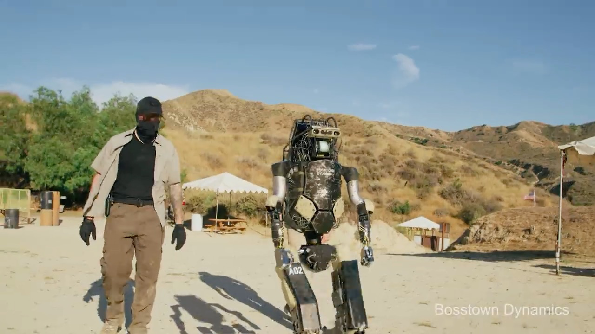

  

  
    <h1>lec0 - 课程介绍和计算机视觉概论</h1>
    

    
计算机学院朋辈辅学课程 -- 论文阅读和科研探索(CV)

    
By <a href="https://github.com/cxzhou35">@Chenxu Zhou</a>

    

      
2023.10.14

      
Powered by <a href="https://github.com/webpro/reveal-md">@reveal-md

    

  

<!--v-->

## Table of Contents

1. 课程背景
    1. 为什么开设这门课程
    2. 从这门课中可以学到什么
2. 课程安排
    1. 关于讲师
    2. 内容与时间安排
    3. 课程资料
3. 计算机视觉概论
4. 课前须知

<!--s-->

    

# Part.1 课程背景

<!--v-->

## 为什么开设这门课程？

- 很多同学有进实验室进行科研的想法，却不知道如何着手
  - 担心能力不够 -- 如何提高科研能力❗
  - 担心时间不够 -- 如何提高工作效率❗
  - 担心进组学习不到东西 -- 如何选择感兴趣的方向以及好的组❗
  - ......

- 受到实验室学长的启发，本人也希望可以将经验和经历分享到社区

> 强烈推荐阅读彭思达学长的科研经历分享 <a href="https://github.com/pengsida/learning_research"><i class="fab fa-github">Learning _research</i></a>
>
> 课程中相关内容转载自该文档 copyright @ [pengsida](https://pengsida.net/)

<!--v-->

## 关于课程受众

这确实是一个很头疼的问题:

- 对于还没接触过科研或者刚加入实验室的同学，深入提高科研能力还具有一定的距离
- 对于已经在做科研项目的同学，内容过于基础会显得乏味
- 于是 ......

采取折中策略，课程会覆盖从联系实验室到自己做项目的全流程

同时，考虑到很多课程内容如果不确定课程主题会很难开展 
因此我和胡梓敬同学分别开设了AI和CV的课程班

课程主题会以3D CV为主，2D CV已经快被 SAMs 解决了 :)  

对其他领域(NLP/System etc.)感兴趣的同学课程体验会有折扣 

当然，如果有需求欢迎联系学指同学反馈，如果你也想开设这样的课程，欢迎之后报名！

<!--v-->

## 从这门课中可以学到什么?

声明: 本课程的相关教学内容会以课程主题(CV)为核心

- 了解科研在做什么，体验从联系实验室到自己做项目的过程
- 提高科研能力，包括文献检索能力、文献阅读能力、技术跟踪能力等
- 掌握科研中需要用到的工具(Git/GitHub/LaTeX/Terminal etc.)
- 了解3DV的前沿领域在做什么
- ......

> 课程教学内容偏理想化，和实际的科研体验一定会有偏差❗ 
>
> 请不要通过本课程来判断自己是否对科研感兴趣❗

<!--s-->

    

# Part.2 课程安排

<!--v-->

## 关于讲师

#### 周晨旭

- 20 级光电专业
- ZJU 3DV Group成员
- Taichi Graphics 实习生
- Github [@cxzhou35](https://github.com/cxzhou35) <i class="fab fa-github"></i>
- 笔记[https://zicx.top/notebook](https://zicx.top/notebook/)
- Vim 爱好者/开发者 ➡️   [my config](https://github.com/cxzhou35/awesome-neovim/tree/lazy)

Research interest

- Dynamic Scene Reconstruction
- Neural Rendering
- Computer Graphics

<!--v-->

## 内容与时间安排

|课程|日期|讲师|
|:-|:-|:-|
|lec0：课程介绍和计算机视觉概论  |10.14（秋四周）|Zicx|
|lec1：方向选择和科研入门        |10.22（秋五周）|Zicx|
|lec2: 文献检索和文献管理        |11.05（秋七周）|Zicx|
|lec3：文献阅读                  |11.19（冬一周）|Zicx|
|lec4：文献引用和LaTeX排版       |12.03（冬三周）|Zicx|
|lec5：复现论文和阅读源码        |12.17（冬五周）|Zicx|
|lec6：科研经验分享              |12.31（冬七周）|Zicx|

*课程内容和时间均为暂定，随着课程进度会有更新 

有想听的内容也欢迎联系我讨论交流！

<!--v-->

## 课程资料

- 课程仓库: [cxzhou35/learning_cv](https://github.com/cxzhou35/learning_cv) <i class="fab fa-github"></i>
- 课程主页: [zicx.top/learning_cv](https://zicx.top/learning_cv/slides/site/2023-fall-pbfx) <i class="fab fa-github"></i>
- 课程答疑专区: [learning_cv/discussions/2](https://github.com/cxzhou35/learning_cv/discussions/2)

> 本学期的课程均为线下课程，不再有线上直播和回放❗
>
> 冬学期的双周仍然开展教学活动，但会以非上课的其他形式进行，内容还没想好，如果有想法也可以联系我交流~

<!--s-->

    

# Part.3 计算机视觉概论

<!--v-->

## 什么是计算机视觉?

[Wikipedia - Computer vision](https://en.wikipedia.org/wiki/Computer_vision)

简单理解：从真实世界的高维数据中获得信息，并根据该信息进行不同的研究和探索

  

<!--v-->

## 计算机视觉的应用领域

  

Face Reconstruction and Recognition

<!--v-->

## 计算机视觉的应用领域

  

Augmented Reality

<!--v-->

## 计算机视觉的应用领域

  

Robot Perception

<!--v-->

## 科研能力要求

声明: 这里的科研能力指的是理论上需要掌握的前置知识

- 数理基础: 线性代数、微积分、概率论
- 代码能力:
  - 编程语言: Python(most)、C++、CUDA、Matlab(?)
  - 深度学习框架: PyTorch(most)、Tensorflow、Caffe
- 常用工具
  - Git/GitHub
  - Linux/Terminal/Shell
  - Conda/pip
  - SSH
- ......

<!--v-->

## 课程学习推荐

- 计算机视觉
  - [Andreas Geiger - Computer Vision](https://uni-tuebingen.de/fakultaeten/mathematisch-naturwissenschaftliche-fakultaet/fachbereiche/informatik/lehrstuehle/autonomous-vision/lectures/computer-vision/)
  - [Stanford - CS231n](http://cs231n.stanford.edu/index.html)
  - [ZJU - 计算机视觉导论](https://zju-turing.github.io/TuringCourses/major_mandatory/computer_vision/)

- 计算机图形学
  - [GAMES101-现代计算机图形学入门](https://games-cn.org/intro-graphics/)
  - [GAMES202-高质量实时渲染](https://sites.cs.ucsb.edu/~lingqi/teaching/games202.html)

> 重点是完成课程里的作业，会做作业也就懂课程内容了，建议在GitHub上维护一个repo，存放作业和课程学习笔记

<!--s-->

    

# Part.4 课前须知

<!--v-->

## 如何学习这门课程?

- 牢记两个缩写：
    - RTFM: Read The F**king Manual
    - STFW: Search The F**king Web
        - 百度搜索、百度知道、百度百科、CSDN？❌
        - 必应搜索、谷歌搜索、Wikipedia、GitHub、StackOverflow！✅
- 一定要自己进行实操❗️
- 多和同学、老师交流
- 还没有 GitHub 账号❓赶紧注册
- 不知道怎么运用魔法来上网❓98 上搜搜，这是不能公开碰的滑梯 
  学会了之后可以干什么嘞？
  - GitHub/Google/Twitter(X)/YouTube 都可以注册了
  - Google Scholar 可以用了
  - 很多Paper的网站可以看了
  - ......

<!--v-->

## 培养一些好的习惯

- 多接触英文资料，熟悉英文环境
- 遇到问题先search，research = re + search，并且使用RTFM、STFW
- 每天写一点东西，并且保持一定的规范
  - 实验文档
  - 学习笔记
  - 阅读感想
  - ......
- 开始工作之前先做好规划，包括短期和长期的
- 构建自己熟悉且方便快捷的工作环境与工作流
- 每天接触一点感兴趣的新知识，保持新鲜感

<!--s-->

    

# Thank You

Questions?

